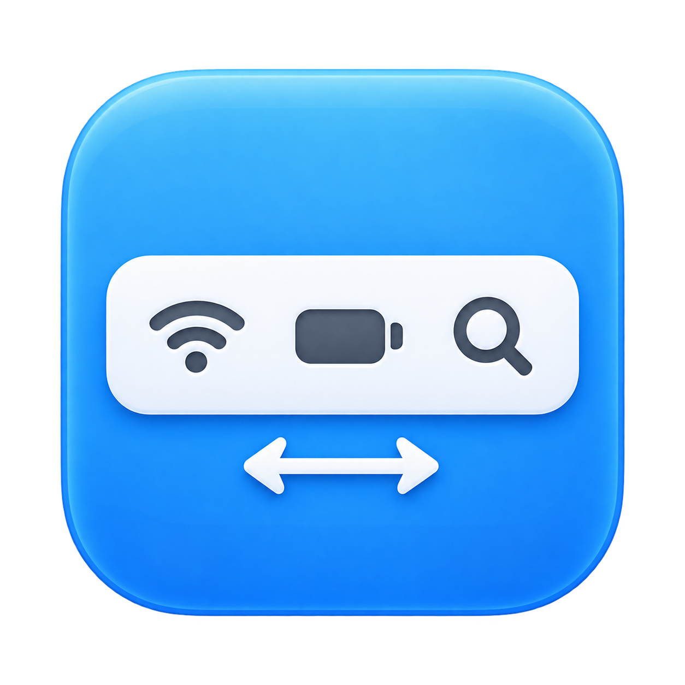
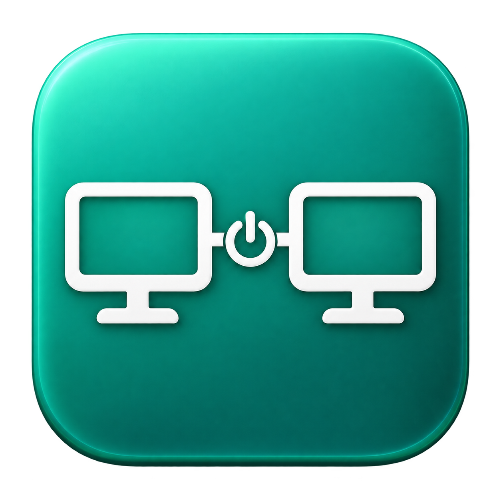
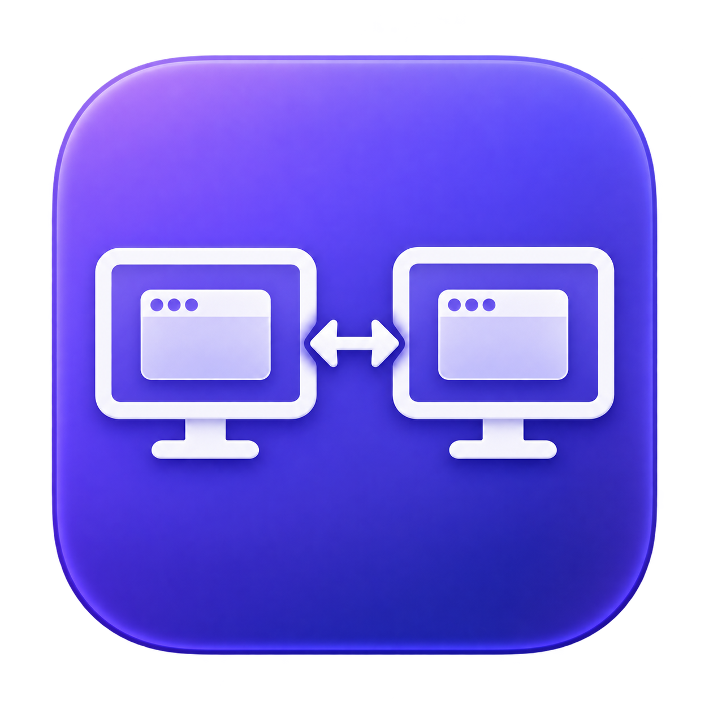

# macOS Desktop Tools

Three small macOS apps for menu bar spacing and display controls. Download a ZIP, unzip it, and open the app. You can keep it anywhere or move it to Applications. There is no installer and no background service.

## Apps

| Icon | App | What it does |
| --- | --- | --- |
|  | **Menu Bar Spacing** | Set menu bar item spacing and selection padding together. Opens with the saved spacing value and includes Restore Defaults. |
|  | **DisplayLink Toggle** | Open or quit DisplayLink Manager. |
|  | **Toggle Display Mode** | Switch secondary displays between mirroring the main display and extending to its left. |

**[Download the latest release](https://github.com/tzwei94/macos-desktop-tools/releases/latest)**. Each app has its own ZIP; `SHA256SUMS` contains download checksums.

### Menu Bar Spacing

Open the app to see the current saved spacing in the input field. If no valid whole-number override exists, the field starts at 3; the current-settings labels still show the saved values or System default. Enter a whole number from 0 to 32 and choose Apply. Restore Defaults removes both overrides. The app reads back both preferences after a change and restores the prior values if applying fails.

The settings are the current-host global preferences `NSStatusItemSpacing` and `NSStatusItemSelectionPadding`. These are undocumented macOS preferences, so their visual effect can vary by macOS version. Some menu bar items may need to restart; logging out and back in may be needed. The app does not restart your apps or log you out.

### DisplayLink Toggle

Install a compatible version of **[DisplayLink Manager from Synaptics](https://www.synaptics.com/products/displaylink-graphics/downloads/macos)** first. This utility does not include drivers. If Manager is running, the toggle sends its user-quit signal so Manager can stop its restart helper before exiting. It falls back to a normal quit if Manager remains running. If Manager is off, the toggle opens it. After quitting, it checks that Manager remains closed for two seconds and reports failed quits or immediate restarts. The toggle does not change login items or service settings.

The user-quit notification is an undocumented DisplayLink interface verified with Manager 17.0.24. In a live check it stayed off beyond the restart helper's interval, and a later toggle turned it back on. Future versions may change this interface. Native macOS APIs handle running-state checks, normal quitting, and launching; no Accessibility permission is needed.

Quitting DisplayLink Manager disconnects displays driven by it. Other displays are unaffected by this utility's direct actions. DisplayLink Manager has its own OS compatibility and permission requirements.

### Toggle Display Mode

Requires a main display and at least one secondary display. If any secondary display belongs to a mirror set, opening the app extends all secondary displays to the left. Otherwise, it mirrors all secondary displays to the main display. With several secondary displays, they are placed side by side to the left in the order reported by macOS.

This changes the saved display arrangement and may briefly blank the screens. Extending places the top edges level with the main display. The helper is included inside the app, so no separate helper installation is needed. If arranging the extended displays fails after unmirroring, the helper attempts to restore the previous arrangement and reports any recovery failure.

## Compatibility and opening the apps

The app launchers and display helper contain Apple silicon and Intel builds with a macOS 13 deployment target. Local checks ran on macOS 27 with Apple silicon. Intel execution and older macOS versions have not been tested. DisplayLink Manager support depends on the version you install. Managed Macs may restrict these tools.

These builds use ad-hoc signatures; they are **not Developer ID signed or notarized**. macOS may block a downloaded app. If you trust the source, follow [Apple's instructions for opening an app from an unidentified developer](https://support.apple.com/en-sg/102445): attempt to open it, then use System Settings → Privacy & Security → Open Anyway if available.

Each app contains a native `.icns` icon and a Windows-format `.ico` copy. macOS displays the `.icns` icon. The original PNGs and both converted formats are in `assets/icons/`.

## Build and check

Development requires macOS, Xcode Command Line Tools with Swift, and Python 3. The finished apps use system libraries; Python and developer tools are not required to run them.

```sh
bash tools/test.sh
bash tools/build.sh
python3 tools/verify-packages.py
```

Outputs are in `dist/`. To regenerate the icon formats from the supplied PNGs, run `python3 tools/make-icons.py` before building. A release tag must match `VERSION`, for example `v1.0.0`.

Checks cover 15 isolated preference scenarios, 12 display-planning cases, native app lifecycle tests, AppleScript compilation, embedded icons, bundle metadata, both binary architectures, strict signatures, ZIP extraction, and checksums. Preference tests use a temporary domain, not your global preferences. Lifecycle tests use an isolated app fixture to check missing-app errors, turning on, the user-quit signal, quitting without restarting, and repeated toggles. Test notifications use a separate name and never request the real Manager to quit. The display helper's read-only status was checked locally. Physical mirror/extend transitions and recovery under a real display failure were not exercised during review.

The apps do not request a login or contain credentials. Display Mode and Menu Bar Spacing use local macOS settings; DisplayLink Toggle delegates to the separately installed Manager.
